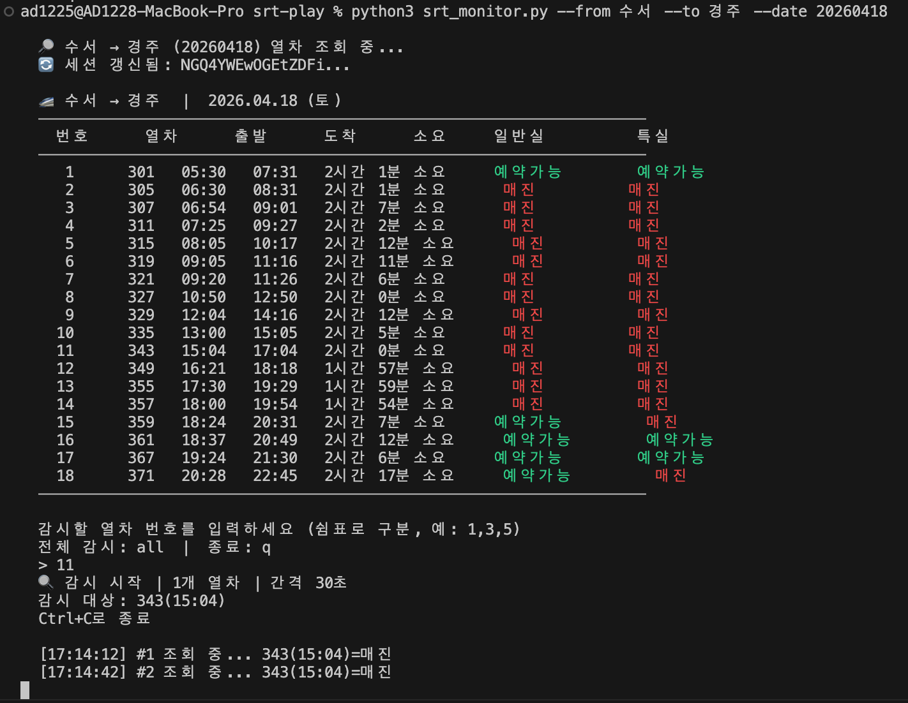

# srt-play
bring me to the gyeongju

## draft
* SRT공식페이지는 api스펙이 너무많이바뀌는데 srtplay여기는 뭐바뀌지도않고 딱히 세션검증을 철저히하는것도 아니고 걍 세션없으면 302리턴해서 리다이렉션하는거밖에 별다른... 방어라고할지 그런게 없음
```
curl 'https://srtplay.com/ticket/reservation/schedule/proc' \
  -H 'Accept: */*' \
  -H 'Accept-Language: ko,en-US;q=0.9,en;q=0.8,ja;q=0.7' \
  -H 'Connection: keep-alive' \
  -H 'Content-Type: application/x-www-form-urlencoded; charset=UTF-8' \
  -b 'XSRF-TOKEN=**censored**; remember-me=**censored**; SESSION=**censored**; ' \
  --data-raw '_csrf=**censored**&passenger1=1&passenger2=0&passenger3=0&passenger4=0&passenger5=0&handicapSeatType=015&selectScheduleData=&psrmClCd=&isGroup=&isCash=&dptRsStnCd=0551&dptRsStnNm=%EC%88%98%EC%84%9C&arvRsStnCd=0553&arvRsStnNm=%ED%8F%89%ED%83%9D%EC%A7%80%EC%A0%9C&dptDt=20260418&dptTm=0&dptDtTxt=2026.+4.+18.&dptDayOfWeekTxt=(%ED%86%A0)'
```
* 일케 파라미터 대충채워서 보내면 매진여부랑 시간표 리턴해줌
* 그럼 이제 문제는 세션인데 세션 초기화가 막 그렇게 빠르지도 느리지도 않음 체감상 한 한시간? 두시간
* env에 보면 csrf, session, remember-me(ㅎ) 일케 세개의 파라미터가 있는데 이 셋 중에서 session만 바뀜 나머지 둘은 고정임(remember-me도 고정은 아닌거같은데 그냥 충분히 긴 것 같음)
* session이 초기화되면
```
curl -i 'https://srtplay.com/ticket/reservation/schedule/proc' \
  -H 'Accept: */*' \
  -H 'Accept-Language: ko,en-US;q=0.9,en;q=0.8,ja;q=0.7' \
  -H 'Connection: keep-alive' \
  -H 'Content-Type: application/x-www-form-urlencoded; charset=UTF-8' \
  -b 'XSRF-TOKEN=**censored**; remember-me=**censored**; SESSION=**deprecatedSession**; ' \
  --data-raw '_csrf=**censored**&passenger1=1&passenger2=0&passenger3=0&passenger4=0&passenger5=0&handicapSeatType=015&selectScheduleData=&psrmClCd=&isGroup=&isCash=&dptRsStnCd=0551&dptRsStnNm=%EC%88%98%EC%84%9C&arvRsStnCd=0553&arvRsStnNm=%ED%8F%89%ED%83%9D%EC%A7%80%EC%A0%9C&dptDt=20260418&dptTm=0&dptDtTxt=2026.+4.+18.&dptDayOfWeekTxt=(%ED%86%A0)'
```
* 이렇게 걍호출하면... 리턴헤더에 set-cookies로 세션을 새로발급해준다 ㅇㅅㅇ..
* 상식적으로 request cnt limit이 있을거같은데 언제 밴되는지는 모르겠음 그냥 눈치껏..
* 파라미터 꼬라지 passenger1,2,3,4,5 boolean 

## demo

* 필요에 따라서 메일알림을 넣던가 소리를 나게 하던가 디스코드 봇이랑 연결하던가 어쩌구 그런건 알아서